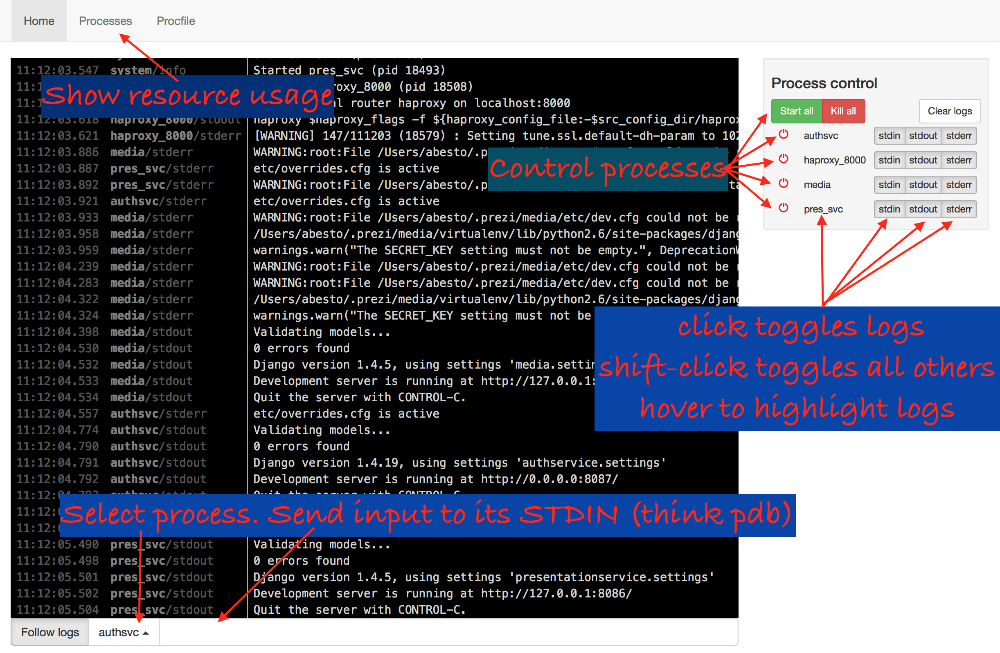

# `procfile-web`

A web-based UI for managing `Procfile`-described service groups during development. Status: works for the author, little real-world usage so far. Proceed cautiously, but bravely.



## Getting started

```
cd procfile-web
curl https://install.meteor.com/ | sh
meteor
```

This Meteor app can be configured as described in [Meteor.settings](http://docs.meteor.com/#/full/meteor_settings).
The available fields:

| Field    | Default | Description |
|----------|---------|-------------|
| `procfilePath` | Load bundled Procfile from [`private/Procfile.example`](private/Procfile.example) | Path of the `Procfile` to load at startup |
